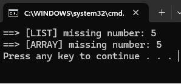

## Array Manipulation and Missing Number Problem

### Problem Statement
You have an array of n distinct numbers from 1 to n + 1. One number from this range is missing from the array. Find the missing number.

```bash 

Input: [3, 7, 1, 2, 6, 4]
Output: 5 (since 5 is missing)

Constraints:
The array will always contain distinct numbers.

```

### Result
<>

