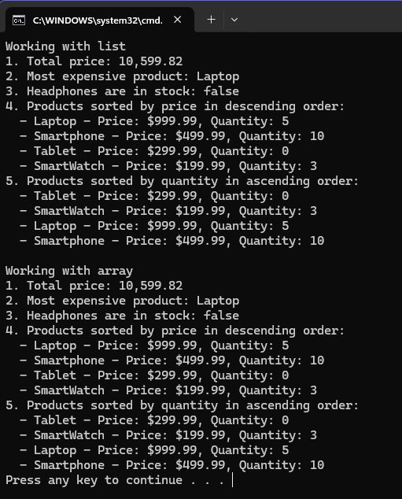

## Product Inventory Management

### Problem Statement
You are given a **Product** class with the following fields:
- `name`: A String representing the product's name.

- `price`: A Double representing the product's price.

- `quantity`: An Int representing the product's quantity.

#### Product List

```bash
Product List:

Laptop: price: 999.99, quantity: 5
Smartphone: price: 499.99, quantity: 10
Tablet: price: 299.99, quantity: 0
Smartwatch: price: 199.99, quantity: 3

```
- Calculate the total value of the inventory (price multiplied by quantity for each product).
- Find the most expensive product.
- Check if a product named `Headphone` is in stock.
- sort the products by price/quantity in descending/ascending order.

### Result
<>

